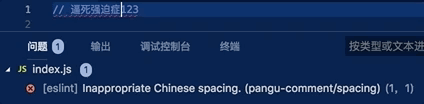

# eslint-plugin-pangu-comment

Pangu whitespace for Chinese comments.



## Installation

You'll first need to install [ESLint](http://eslint.org):

```
$ npm i eslint --save-dev
```

Next, install `eslint-plugin-pangu-comment`:

```
$ npm install eslint-plugin-pangu-comment --save-dev
```

**Note:** If you installed ESLint globally (using the `-g` flag) then you must also install `eslint-plugin-pangu-comment` globally.

## Usage

Add `pangu` to the plugins section of your `.eslintrc` configuration file. You can omit the `eslint-plugin-` prefix:

```json
{
    "plugins": [
        "pangu-comment"
    ]
}
```


Then configure the rules you want to use under the rules section.

```json
{
    "rules": {
        "pangu/rule-spacing": 2
    }
}
```

## Supported Rules

* Spacing
